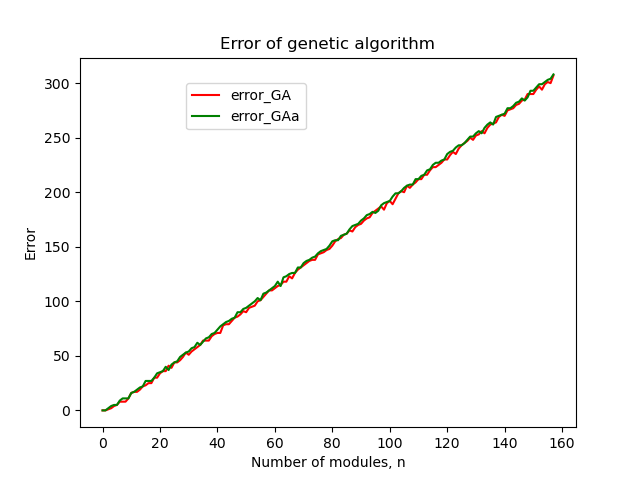

1. Install geatpy: 
 ```
pip install geatpy
 ```

2. Change direction to the "GA" folder and then run: 
 ```
python GA.py
 ```

When I change the maximum generation from 200 to 1000, the error is the same: 

